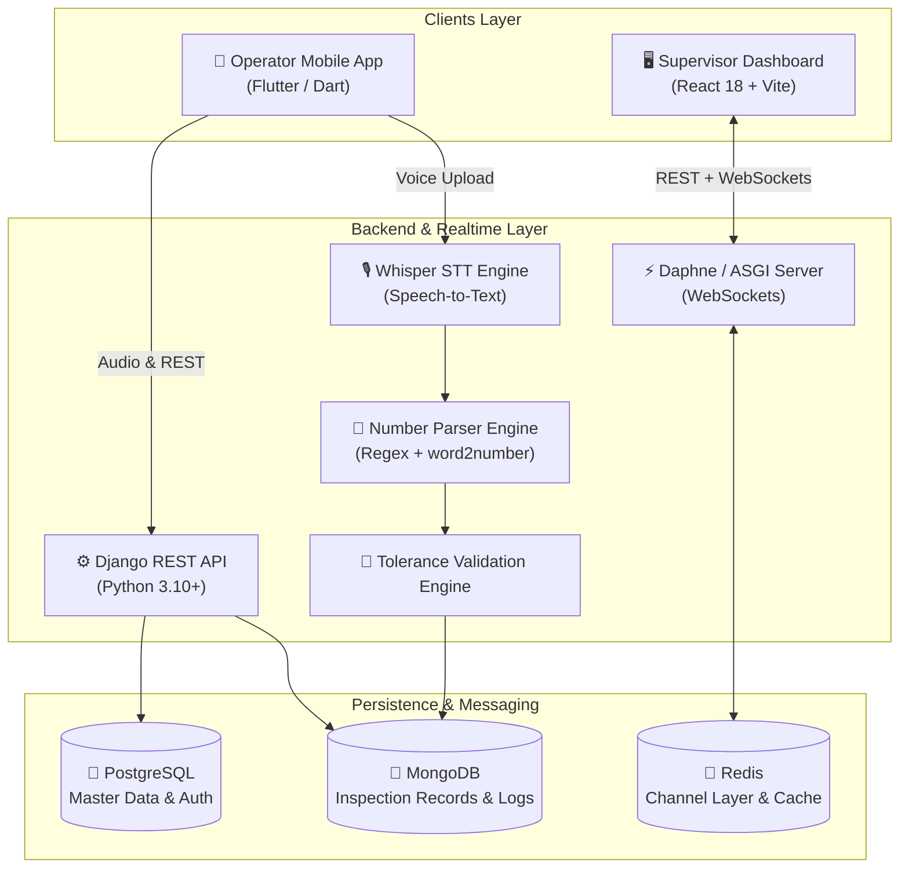
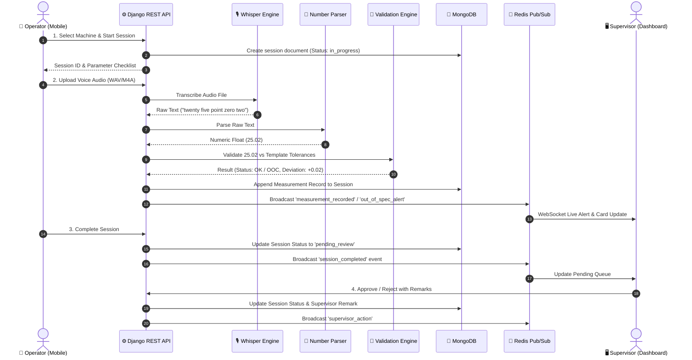
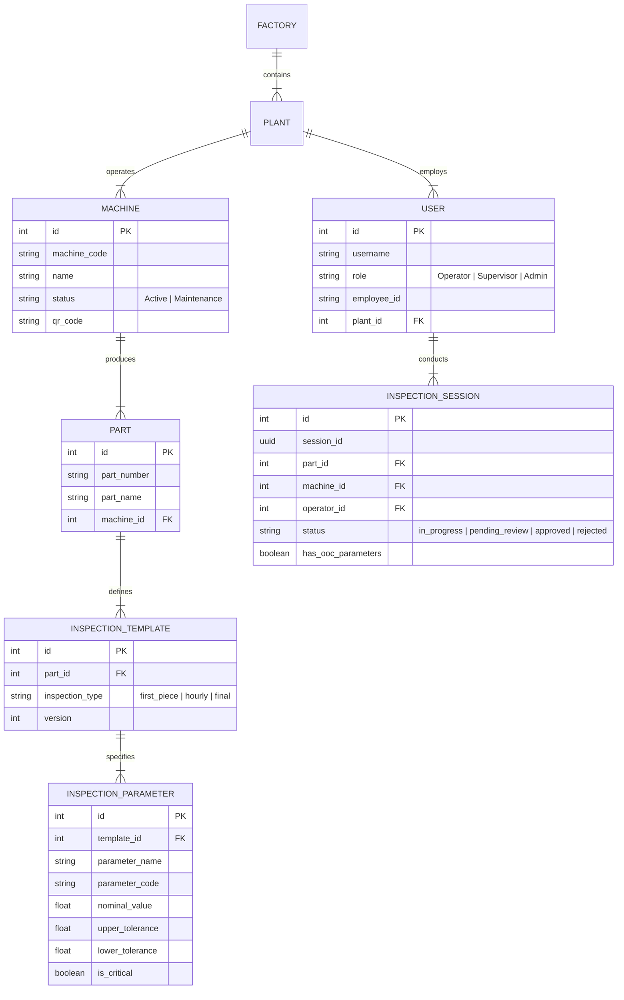

# Voice-Driven Machine Inspection & Ledger Automation System

An enterprise-grade, real-time quality control and ledger automation platform designed for modern manufacturing floors. Operators record physical part measurements hands-free using voice recognition (**Whisper Local / API**), which automatically converts spoken values to numerical data, validates them against multi-parameter engineering tolerances in real-time, and streams live inspection updates to a supervisor dashboard via WebSockets.

---

## 🏗️ High-Level System Architecture



---

## 📐 Comprehensive System Design

### 1. Architectural Core Principles

- **CQRS-Inspired Dual Database Pattern**:
  - **Relational Store (PostgreSQL)**: Handles structured, ACID-compliant master data including plants, factories, operators, machines, parts, and engineering tolerance templates.
  - **Document Store (MongoDB)**: Handles high-throughput, dynamic inspection sessions. Measurements vary across different parts and contain nested voice logs, audio references, and status tags.
- **Decoupled Real-Time WebSockets**: Using **Django Channels** and **Redis Channel Layer**, live events are broadcasted asynchronously across plant-specific WebSocket groups (`plant_{plant_id}`).
- **Resilient Voice Pipeline**: Audio is captured on mobile devices, processed locally/server-side using Whisper STT, normalized via multi-pass number parsing algorithms, and validated against tolerance rules in milliseconds.

---

### 2. End-to-End Data Flow Sequence



---

### 3. Database Schema & Data Modeling

#### Relational ER Diagram (PostgreSQL)



#### Document Schema (MongoDB - `inspection_records` collection)

```json
{
  "_id": "ObjectId('65d4f1a2e4b0a123456789ab')",
  "inspection_session_id": "c7a8f912-34bc-4d8e-9012-ef3456789abc",
  "part_number": "PN-FBT-00222",
  "machine_code": "CNC-01",
  "operator_id": 5,
  "supervisor_id": 3,
  "inspection_type": "first_piece",
  "shift": "A",
  "status": "pending_review",
  "started_at": "2026-07-24T06:00:00Z",
  "completed_at": "2026-07-24T06:15:30Z",
  "measurements": [
    {
      "parameter_code": "BD-01",
      "parameter_name": "Bore Diameter",
      "nominal": 25.00,
      "upper_limit": 25.02,
      "lower_limit": 24.98,
      "measured_value": 25.01,
      "deviation": 0.01,
      "unit": "mm",
      "status": "ok",
      "is_critical": true,
      "voice_raw_text": "twenty five point zero one",
      "voice_audio_file": "media/audio/2026/07/24/session_c7a8_BD01.wav",
      "method": "voice",
      "recorded_at": "2026-07-24T06:02:10Z"
    },
    {
      "parameter_code": "OD-02",
      "parameter_name": "Outer Diameter",
      "nominal": 50.00,
      "upper_limit": 50.05,
      "lower_limit": 49.95,
      "measured_value": 50.08,
      "deviation": 0.08,
      "unit": "mm",
      "status": "out_of_spec",
      "is_critical": true,
      "voice_raw_text": "fifty point zero eight",
      "voice_audio_file": "media/audio/2026/07/24/session_c7a8_OD02.wav",
      "method": "voice",
      "recorded_at": "2026-07-24T06:05:45Z"
    }
  ],
  "supervisor_remark": "",
  "approved_at": null
}
```

---

### 4. Speech Recognition & Number Parsing Engine

```
[ Operator Spoken Voice Input ]
              │
              ▼
[ Audio Preprocessing (WAV / 16kHz mono via FFmpeg) ]
              │
              ▼
[ OpenAI Whisper STT Model (Local CPU/GPU Inference) ]
              │  Transcribed Text (e.g. "twenty five point zero two millimeters")
              ▼
[ Multi-Stage Number Parsing Engine ]
  ├─ Step 1: Direct Regex match for numbers (e.g. "25.02")
  ├─ Step 2: Spoken text conversion via word2number ("twenty five" → 25)
  ├─ Step 3: Decimal parsing ("point zero two" → 0.02)
  ├─ Step 4: Unit & noise stripping ("mm", "millimeters", "degrees")
  └─ Step 5: Negative value handling ("minus three" → -3.0)
              │
              ▼
[ Clean Numeric Value: 25.02 (Float) ]
```

---

### 5. Real-Time WebSocket Channel Strategy

The application uses **Django Channels** backed by **Redis Pub/Sub** for live updates:

- **Group Topic**: `plant_{plant_id}` (e.g. `plant_1`)
- **Event Types**:
  1. `measurement_recorded`: Pushes individual measurement to supervisor feed.
  2. `out_of_spec_alert`: Emits glowing alert banner on supervisor UI when a reading breaks tolerance limits.
  3. `session_completed`: Updates "Pending Review" count badge in real-time.
  4. `supervisor_action`: Notifies all connected supervisors when a session is approved or rejected.

---

### 6. Role-Based Access Control (RBAC) Matrix

| Feature / Action | Operator | Supervisor | Quality Engineer | Admin |
|---|:---:|:---:|:---:|:---:|
| Start Inspection & Upload Voice | ✅ | ❌ | ❌ | ✅ |
| View Live Dashboard Feed | ❌ | ✅ | ✅ | ✅ |
| Approve / Reject Inspections | ❌ | ✅ | ✅ | ✅ |
| View Analytics & OOC Trends | ❌ | ✅ | ✅ | ✅ |
| Manage Machines, Parts & Tolerances | ❌ | ❌ | ✅ | ✅ |
| User Management & Plant Assignment | ❌ | ❌ | ❌ | ✅ |

---

## 🌟 Key Features

### 📱 Operator Mobile Application (Flutter)
- **Hands-Free Voice Entry:** Record dimensional and visual inspection readings using voice prompts on the shop floor.
- **Instant Speech Parsing:** Parses spoken text (e.g. *"twenty five point zero two millimeters"*) into exact numerical values automatically.
- **Real-Time Tolerance Checks:** Instant visual and acoustic feedback informing operators if a value is **OK** or **Out of Spec (OOC)**.
- **Part & Machine Selection:** Scan QR codes or select machines/parts to load active inspection templates dynamically.

### 🖥️ Supervisor Dashboard (React + Vite)
- **Live Inspection Feed:** WebSocket-driven live updates showing active shop-floor sessions, progress bars, and instant OOC alerts.
- **Pending Review Queue:** Dedicated interface for supervisors to inspect, add remarks, and approve or reject completed sessions.
- **Shift & Machine Analytics:** 7-day failure trend line charts, shift pass/fail breakdowns, and per-machine failure rates powered by **Recharts**.
- **Dark Mode UI:** Modern dark-theme glassmorphism interface styled with pure Vanilla CSS tokens.

### ⚙️ Backend Core (Django REST & WebSockets)
- **Dual-Database Architecture:** 
  - **PostgreSQL:** Relational master data (Users, Factories, Plants, Machines, Parts, Inspection Templates, Parameters).
  - **MongoDB:** High-throughput document store for session measurement histories, raw voice transcriptions, and audit logs.
- **Validation Engine:** Evaluates measured values against Nominal, Upper Tolerance, and Lower Tolerance thresholds, flagging critical parameter violations.
- **Role-Based Access Control (RBAC):** JWT authentication (`SimpleJWT`) supporting **Operator**, **Supervisor**, **Quality Engineer**, and **Admin** roles.

---

## 📂 Repository Structure

```
Ledger_entry_automation/
├── backend/                  # Django 6.0 REST API & ASGI Server
│   ├── apps/
│   │   ├── users/            # Authentication, JWT, Roles & Permissions
│   │   ├── machines/         # Factory, Plant, and Machine management
│   │   ├── parts/            # Part numbers, templates & parameter tolerances
│   │   ├── inspections/      # Session records, validation engine, approval workflow
│   │   ├── voice/            # Speech-to-Text (Whisper Local/API) & Number Parser
│   │   ├── dashboard/        # WebSocket consumers & live event routing
│   │   └── analytics/        # Shift summaries, OOC trends & machine stats
│   ├── common/               # Shared base models & utility functions
│   ├── config/               # Settings, ASGI/WSGI routing & MongoDB connectors
│   ├── seed_fbt00222.py      # Database seeder script for demo templates
│   └── requirements.txt      # Python dependencies
├── dashboard/                # React 18 + Vite Supervisor Dashboard
│   ├── src/
│   │   ├── api/              # Axios instance & API endpoints
│   │   ├── components/       # Layout, Cards, Modals & Recharts components
│   │   ├── context/          # AuthContext & WebSocketContext
│   │   ├── pages/            # Dashboard, Pending Review, Session Detail, Analytics
│   │   └── index.css         # Custom Design System (CSS variables & glassmorphism)
│   └── package.json
├── mobile/                   # Flutter Mobile App for Shop Floor Operators
│   ├── lib/                  # Dart source code (Auth, Inspection, Audio recording)
│   └── pubspec.yaml
├── database/                 # Database scripts & schema migrations
├── deployment/               # Container & server deployment configs
└── docs/                     # Project documentation & architecture notes
```

---

## 🛠️ Technology Stack

| Layer | Technology | Description |
|---|---|---|
| **Backend API** | Django 6.0 + DRF | RESTful endpoints & business logic |
| **Realtime / WS** | Django Channels + Daphne | WebSockets for live shop-floor feeds |
| **Speech Recognition** | `openai-whisper` | Local CPU/GPU speech transcription |
| **Number Parsing** | `word2number` + Custom Regex | Converts verbal input to float numbers |
| **Relational DB** | PostgreSQL | User auth, master templates, machine metadata |
| **Document DB** | MongoDB (PyMongo) | Flexible inspection sessions & audio logs |
| **Message Broker** | Redis | Channels layer & real-time pub/sub |
| **Supervisor Frontend** | React 18 + Vite | SPA dashboard with Recharts & Lucide icons |
| **Mobile Frontend** | Flutter (Dart) | Cross-platform operator mobile application |

---

## 🚀 Getting Started

### Prerequisites
Ensure you have the following installed on your machine:
- **Python** `3.10+`
- **Node.js** `18+` & **npm**
- **Flutter SDK** `3.x`
- **PostgreSQL** `14+`
- **MongoDB** `6+`
- **Redis Server**
- **FFmpeg** (Required for Whisper audio processing)

---

### 1. Backend Setup

```bash
# Navigate to backend directory
cd backend

# Create and activate virtual environment
python -m venv venv
# On Windows:
venv\Scripts\activate
# On Linux/macOS:
source venv/bin/activate

# Install dependencies
pip install -r requirements.txt

# Create .env file (see Configuration section below)
cp .env.example .env  # or configure environment variables

# Run database migrations (PostgreSQL)
python manage.py makemigrations
python manage.py migrate

# Seed initial factory data (Machines, Parts & Templates)
python seed_fbt00222.py

# Start the Daphne ASGI Development Server (HTTP + WebSockets)
daphne -b 127.0.0.1 -p 8000 config.asgi:application
# OR standard WSGI server (HTTP only):
# python manage.py runserver
```

---

### 2. Supervisor Dashboard Setup

```bash
# Navigate to dashboard directory
cd dashboard

# Install dependencies
npm install

# Start Vite development server
npm run dev
```

The dashboard will be available at `http://localhost:5173`.

---

### 3. Mobile App Setup

```bash
# Navigate to mobile directory
cd mobile

# Fetch dependencies
flutter pub get

# Run on emulator or connected physical device
flutter run
```

---

## ⚙️ Environment Configuration

### Backend `.env` Settings

| Variable | Default Value | Description |
|---|---|---|
| `SECRET_KEY` | *your-django-secret-key* | Django secret key |
| `DEBUG` | `True` | Debug flag |
| `DB_NAME` | `inspection_db` | PostgreSQL database name |
| `DB_USER` | `postgres` | PostgreSQL username |
| `DB_PASSWORD` | `postgres` | PostgreSQL password |
| `DB_HOST` | `localhost` | PostgreSQL host |
| `DB_PORT` | `5432` | PostgreSQL port |
| `MONGODB_URI` | `mongodb://localhost:27017` | MongoDB connection string |
| `MONGODB_NAME` | `voice_inspection_db` | MongoDB database name |
| `REDIS_URL` | `redis://localhost:6379` | Redis broker connection URL |
| `WHISPER_MODEL` | `base` | Whisper model size (`tiny`, `base`, `small`, `medium`) |
| `WHISPER_BACKEND` | `local` | `local` (Speech-to-Text model) or `api` |

---

## 📡 API Endpoint Overview

| Method | Endpoint | Description | Auth Required |
|---|---|---|---|
| `POST` | `/api/users/login/` | User login (returns JWT pair) | ❌ |
| `POST` | `/api/users/register/` | Register new operator/supervisor | Admin |
| `GET` | `/api/machines/` | List machines by plant | Yes |
| `GET` | `/api/parts/<part_number>/template/` | Fetch active inspection template & parameters | Yes |
| `POST` | `/api/inspections/start/` | Create new inspection session | Operator |
| `POST` | `/api/inspections/<session_id>/measure/` | Record measurement (manual or voice) | Operator |
| `POST` | `/api/inspections/<session_id>/complete/` | Complete inspection session | Operator |
| `POST` | `/api/voice/transcribe/` | Upload audio file & parse measurement value | Operator |
| `GET` | `/api/inspections/pending/` | List pending review sessions | Supervisor |
| `POST` | `/api/inspections/<session_id>/review/` | Approve/Reject inspection with remarks | Supervisor |
| `GET` | `/api/dashboard/live/` | Live feed status snapshot | Supervisor |
| `GET` | `/api/dashboard/shift-summary/` | Shift metrics & pass/fail KPIs | Supervisor |
| `GET` | `/api/analytics/ooc-trend/` | 7-day Out-of-Control trend data | Supervisor |

---

## 🧪 Real-Time WebSocket Events

**WebSocket URL:** `ws://127.0.0.1:8000/ws/dashboard/<plant_id>/`

Emitted events:
- `measurement_recorded` — Fired when an operator records a parameter value.
- `out_of_spec_alert` — Immediate alert when a measurement fails tolerance checks.
- `session_completed` — Fired when a session status changes to `pending_review`.
- `supervisor_action` — Fired when a supervisor approves or rejects an inspection session.

---

## 📝 License

Distributed under the MIT License. See `LICENSE` for more information.
