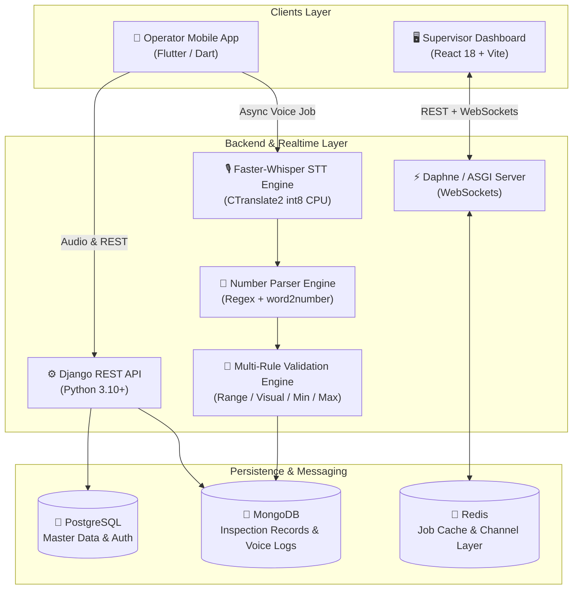
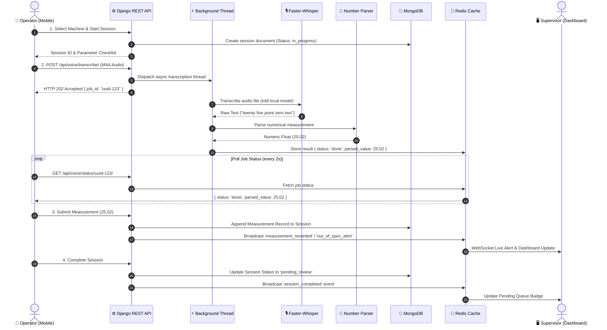
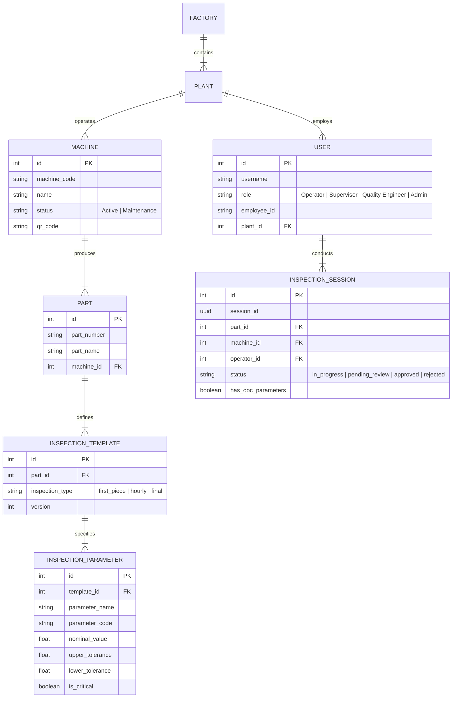

# Voice-Driven Machine Inspection & Ledger Automation System

An enterprise-grade, real-time quality control and ledger automation platform designed for modern manufacturing floors. Operators record physical part measurements hands-free using voice recognition powered by **Faster-Whisper (CTranslate2)**, which automatically converts spoken values to numerical data, validates them against multi-parameter engineering tolerances in real-time, and streams live inspection updates to a supervisor dashboard via WebSockets.

---

## 🏗️ High-Level System Architecture



---

## 🔑 Default Test Credentials

For quick evaluation both locally and on deployed environments:

### 🌐 Deployed Environment (Render / Cloud)
| Role | Username | Password | Employee ID |
|---|---|---|---|
| **Supervisor** | `supervisor` | `Supervisor123!` | `emp-sup1` |
| **Operator** | `operator` | `Operator123!` | `emp-op1` |
| **Inspector** | `inspector` | `Inspector123!` | `emp-ins1` |
| **Admin** | `LihaTech` | `Admin12345!` | `emp-001` |

### 💻 Local Development
| Role | Username | Password | Employee ID |
|---|---|---|---|
| **Supervisor** | `supervisor` | `supervisor123` | `EMP-SUP-01` |
| **Operator** | `operator` | `operator123` | `EMP-OP-01` |
| **Inspector** | `inspector` | `inspector123` | `EMP-INS-01` |
| **Admin** | `admin` | `admin123` | `EMP-ADMIN-01` |

---

## 📐 Comprehensive System Design

### 1. Architectural Core Principles

- **CQRS-Inspired Dual Database Pattern**:
  - **Relational Store (PostgreSQL)**: Handles structured, ACID-compliant master data including plants, factories, operators, machines, parts, and engineering tolerance templates.
  - **Document Store (MongoDB)**: Handles high-throughput, dynamic inspection sessions. Measurements vary across different parts and contain nested voice logs, audio references, and status tags.
- **Decoupled Real-Time WebSockets**: Using **Django Channels** and **Redis Channel Layer**, live events are broadcasted asynchronously across plant-specific WebSocket groups (`plant_{plant_id}`).
- **Asynchronous Non-Blocking Voice Pipeline**:
  - Voice uploads return an `HTTP 202 Accepted` response with a `job_id` in **< 500ms**.
  - Background daemon threads run **Faster-Whisper** with `int8` CPU quantization and pre-downloaded local model caching (`.hf_cache`).
  - Mobile app polls `GET /api/voice/status/<job_id>/` until Redis cache returns the parsed measurement.

---

### 2. End-to-End Voice & Inspection Flow



---

### 3. Multi-Rule Parameter Tolerance Validation Engine

The system supports four distinct validation rules:

| Rule Type | Identification | Example Spec | Validation Logic |
|---|---|---|---|
| **Rule 1: Range** | Default Numeric | `25.00 ± 0.05 mm` | Passes if `Lower Limit <= Value <= Upper Limit` |
| **Rule 2: Visual** | Type: `visual` | `0.5 x 45° Chamfer` | Accepts `1.0`/`YES`/`PASS`/`OK` or `0.0`/`NO`/`REJECT` |
| **Rule 3A: Min Limit** | Type: `min_limit` | `Must be >= 10.0 mm` | Passes if `Value >= Lower Limit` |
| **Rule 3B: Max Limit** | Type: `max_limit` / `surface` | `Must be <= 0.8 µm` | Passes if `Value <= Upper Limit` |

---

### 4. Database Schema & Data Modeling

#### Relational ER Diagram (PostgreSQL)



#### Document Schema (MongoDB - `inspection_records` collection)

```json
{
  "_id": "ObjectId('65d4f1a2e4b0a123456789ab')",
  "inspection_session_id": "c7a8f912-34bc-4d8e-9012-ef3456789abc",
  "part_number": "PN-FBT-00222",
  "machine_code": "CNC-01",
  "operator_id": 5,
  "supervisor_id": 3,
  "inspection_type": "first_piece",
  "shift": "A",
  "status": "pending_review",
  "started_at": "2026-08-21T06:00:00Z",
  "completed_at": "2026-08-21T06:15:30Z",
  "measurements": [
    {
      "parameter_code": "BD-01",
      "parameter_name": "Bore Diameter",
      "nominal": 25.00,
      "upper_limit": 25.02,
      "lower_limit": 24.98,
      "measured_value": 25.01,
      "deviation": 0.01,
      "unit": "mm",
      "status": "ok",
      "is_critical": true,
      "voice_raw_text": "twenty five point zero one",
      "method": "voice",
      "recorded_at": "2026-08-21T06:02:10Z"
    }
  ],
  "supervisor_remark": "",
  "approved_at": null
}
```

---

### 5. Role-Based Access Control (RBAC) Matrix

| Feature / Action | Operator | Inspector | Supervisor | Admin |
|---|:---:|:---:|:---:|:---:|
| Start Session & Record Voice | ✅ | ✅ | ❌ | ✅ |
| Submit 1st Piece Setup Approval | ❌ | ✅ | ❌ | ✅ |
| View Live Dashboard Feed | ❌ | ✅ | ✅ | ✅ |
| Approve / Reject Inspections | ❌ | ✅ | ✅ | ✅ |
| Download Session PDF Reports | ✅ | ✅ | ✅ | ✅ |
| Submit Daily Production Reports | ✅ | ✅ | ✅ | ✅ |
| Manage Machines, Parts & Tolerances | ❌ | ❌ | ✅ | ✅ |

---

## 🌟 Key Features

### 📱 Operator Mobile Application (Flutter)
- **Hands-Free Voice Entry:** Record dimensional and visual inspection readings using voice prompts on the shop floor.
- **Auto-Advance & Speed Mode:** Automatically moves to the next parameter upon successful measurement entry.
- **1st Piece Setup Approval Workflow:** Dedicated screen for inspectors to record and submit process parameter setup approvals.
- **PDF Report Generation:** One-touch download of official First Piece Inspection PDF reports.
- **Daily Production Reports:** Built-in form to log machine shifts, piece counts, idle reasons, and scrap details.

### 🖥️ Supervisor Dashboard (React + Vite)
- **Live Inspection Feed:** WebSocket-driven live updates showing active shop-floor sessions, progress bars, and instant OOC alerts.
- **Pending Review Queue:** Dedicated interface for supervisors to inspect, add remarks, and approve or reject completed sessions.
- **Shift & Machine Analytics:** 7-day failure trend line charts, shift pass/fail breakdowns, and per-machine failure rates powered by **Recharts**.
- **Dark Mode UI:** Modern dark-theme glassmorphism interface styled with pure Vanilla CSS tokens.

### ⚙️ Backend Core (Django REST & WebSockets)
- **Dual-Database Architecture:** PostgreSQL (Relational Master Data) + MongoDB (Document Store & Audit Logs).
- **Faster-Whisper Engine:** Optimized CTranslate2 engine with local model caching (`.hf_cache`) for rapid offline-capable voice processing.
- **Asynchronous Execution & Redis Cache:** Non-blocking background worker threads with Celery compatibility fallback.

---

## 📂 Repository Structure

```
Ledger_entry_automation/
├── backend/                  # Django 6.0 REST API & ASGI Server
│   ├── apps/
│   │   ├── users/            # Authentication, JWT, Roles & Permissions
│   │   ├── machines/         # Factory, Plant, and Machine management
│   │   ├── parts/            # Part numbers, templates & parameter tolerances
│   │   ├── inspections/      # Session records, validation engine, approval workflow, PDF generator
│   │   ├── voice/            # Faster-Whisper engine, tasks & number parser
│   │   ├── dashboard/        # WebSocket consumers & live event routing
│   │   └── analytics/        # Shift summaries, OOC trends & machine stats
│   ├── build.sh              # Production build & Faster-Whisper caching script
│   ├── create_test_users.py  # Local user seeding utility
│   ├── seed_fbt00222.py      # Database seeder script for demo templates
│   └── requirements.txt      # Python dependencies
├── dashboard/                # React 18 + Vite Supervisor Dashboard
│   ├── src/                  # Components, Pages, Context & Styles
│   └── package.json
├── mobile/                   # Flutter Mobile App for Shop Floor Operators
│   ├── lib/                  # Dart source code (Screens, Services, Providers)
│   └── pubspec.yaml
├── deployment/               # Deployment configurations
└── docs/                     # Documentation assets
```

---

## 🛠️ Technology Stack

| Layer | Technology | Description |
|---|---|---|
| **Backend API** | Django 6.0 + DRF | RESTful endpoints & business logic |
| **Realtime / WS** | Django Channels + Daphne | WebSockets for live shop-floor feeds |
| **Speech Recognition** | `faster-whisper` (CTranslate2) | High-speed int8 CPU speech transcription |
| **Number Parsing** | Custom Regex + `word2number` | Converts verbal speech input to float numbers |
| **Relational DB** | PostgreSQL | User auth, master templates, machine metadata |
| **Document DB** | MongoDB (PyMongo) | Flexible inspection sessions & audio audit logs |
| **Message Broker & Cache**| Redis | Channels layer & async job cache |
| **Supervisor Frontend** | React 18 + Vite | SPA dashboard with Recharts & Lucide icons |
| **Mobile Frontend** | Flutter 3.x (Dart) | Cross-platform operator mobile application |

---

## 🚀 Deployment Options

### Option A: Render.com Cloud Deployment
The repository includes a ready-to-use [`build.sh`](file:///e:/Liha_Tech_Project1/Ledger_entry_automation/backend/build.sh) script for Render Web Services:
- Runs database migrations automatically.
- Pre-downloads and bakes the Faster-Whisper `tiny` model into the build artifact (`.hf_cache`).
- Seeds default demo users and factory records.

### Option B: VPS Deployment (Hetzner / DigitalOcean / AWS EC2)
For zero cold-starts and maximum Whisper inference speed on dedicated CPU:
- **Recommended VPS Specs:** 2–4 vCPUs, 4GB–8GB RAM, Ubuntu 22.04 LTS.
- **Service Stack:** Nginx (Reverse Proxy + Let's Encrypt SSL) + Daphne (ASGI) + PostgreSQL + MongoDB + Redis.

---

## 📡 API Endpoint Overview

| Method | Endpoint | Description | Auth Required |
|---|---|---|---|
| `POST` | `/api/users/login/` | User login (returns JWT pair) | ❌ |
| `GET` | `/api/machines/` | List machines by plant | Yes |
| `GET` | `/api/parts/<part_number>/templates/` | Fetch active inspection templates | Yes |
| `POST` | `/api/inspections/start/` | Create new inspection session | Operator |
| `POST` | `/api/voice/transcribe/` | Async audio upload (returns `job_id`) | Operator |
| `GET` | `/api/voice/status/<job_id>/` | Poll voice transcription job status | Operator |
| `POST` | `/api/voice/parse/` | Directly parse text to float number | Operator |
| `POST` | `/api/inspections/<session_id>/measure/` | Record parameter measurement | Operator |
| `POST` | `/api/inspections/<session_id>/complete/` | Complete inspection session | Operator |
| `GET` | `/api/inspections/<session_id>/pdf/` | Download First Piece PDF report | Yes |
| `POST` | `/api/inspections/setup-approval/` | Submit 1st Piece Setup Approval | Inspector |
| `POST` | `/api/inspections/daily-production-reports/` | Submit Daily Production Report | Yes |
| `GET` | `/api/inspections/rejections/` | Fetch active supervisor rejections | Operator |
| `GET` | `/api/dashboard/live/` | Live feed status snapshot | Supervisor |
| `GET` | `/api/analytics/ooc-trend/` | 7-day Out-of-Control trend data | Supervisor |

---

## 📝 License

Distributed under the MIT License. See `LICENSE` for more information.
