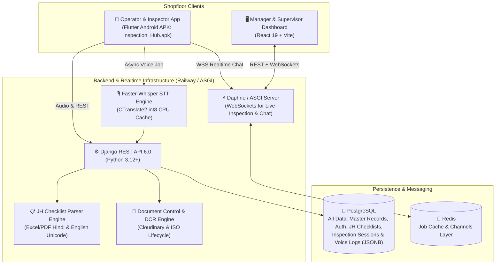

# Inspection Hub — Voice-Driven Machine Inspection, Jishu Hozen (JH) & Ledger Automation System

An enterprise-grade, real-time quality control, autonomous maintenance, and ledger automation platform designed for modern manufacturing floors (IATF 16949 / ISO 9001 compliant).

Operators record physical part measurements hands-free using voice recognition powered by **Faster-Whisper (CTranslate2)**, conduct daily **Jishu Hozen (JH)** autonomous maintenance checklists, access **Controlled Quality Documents (L1:L4 SOPs)**, and communicate via real-time shopfloor messaging—all fully synchronized between the **Flutter Android Mobile App** and the **React Vite Supervisor Dashboard**.

> **Architecture Note:** As of September 2026, the system runs on a **PostgreSQL-only** database architecture. MongoDB was fully deprecated and all inspection data is now stored using PostgreSQL JSONB fields.

---

## 🏗️ High-Level System Architecture


```mermaid
flowchart TB
    subgraph Clients["Shopfloor Clients"]
        Mobile["📱 Operator & Inspector App\n(Flutter Android APK: Inspection_Hub.apk)"]
        Dashboard["🖥️ Manager & Supervisor Dashboard\n(React 19 + Vite)"]
    end

    subgraph Server["Backend & Realtime Infrastructure (Railway / ASGI)"]
        API["⚙️ Django REST API 6.0\n(Python 3.12+)"]
        ASGI["⚡ Daphne / ASGI Server\n(WebSockets for Live Inspection & Chat)"]
        Whisper["🎙️ Faster-Whisper STT Engine\n(CTranslate2 int8 CPU Cache)"]
        JHParser["📋 JH Checklist Parser Engine\n(Excel/PDF Hindi & English Unicode)"]
        DocEngine["📑 Document Control & DCR Engine\n(Cloudinary & ISO Lifecycle)"]
    end

    subgraph Data["Persistence & Messaging"]
        Postgres[("🐘 PostgreSQL\nAll Data: Master Records, Auth, JH Checklists,\nInspection Sessions & Voice Logs (JSONB)")]
        Redis[(🔴 Redis\nJob Cache & Channels Layer)]
    end

    Mobile -->|Audio & REST| API
    Mobile -->|WSS Realtime Chat| ASGI
    Mobile -->|Async Voice Job| Whisper
    Whisper --> API
    API --> Postgres
    API --> JHParser
    API --> DocEngine
    ASGI <--> Redis
    Dashboard <-->|REST + WebSockets| ASGI
```

---

## 🔑 Default Test Credentials

For quick evaluation both locally and on live cloud environments:

### 🌐 Live Production / Local Credentials
For security reasons, production and local credentials are not published in this repository. 

- **Live Production:** Please contact your system administrator to provision your role-based accounts (Admin, Supervisor, Inspector, or Operator).
- **Local Development:** Run `python backend/create_test_users.py` to seed your local database with default test accounts.

---

## 🌟 Major System Modules

### 1. 📋 Jishu Hozen (Autonomous Maintenance - Form QF/MF-08)
* **Official Master Template Generation:** Auto-generates standard Form QF/MF-08 blank Excel workbooks (.xlsx) with machine code, ISO warning badges, and pre-filled standards.
* **Multi-Lingual Checklist Parser:** Ingests Excel and PDF checklists with full support for pure Hindi Unicode and English. Automatically detects tool types (`VISUAL`, `TOOL`), actions (`Clean`, `Lubricate`, `Retighten`), and safety ranks (`A`, `B`, `C`).
* **Machine-Wise Checklist Isolation:** Strict machine-scoped checklists. Each machine can maintain its own isolated checklist version while machines without custom checklists safely inherit factory defaults.
* **Atomic Version Control:** Checklists follow strict monotonic versioning (`v1` $\rightarrow$ `v2`) with deactivation of old items and atomic rollback/restore.
* **Shopfloor Shift Execution:** Operators record shift evaluations (`OK`, `NOT_OK`, `CORRECTED`) with automatic health calculation (`ALL_OK`, `HAS_ISSUES`, `CORRECTED`) and idempotent resubmission protection.
* **31-Day Compliance Matrix:** Monthly grid plotting each day × shift (8-hour 3-shift or 12-hour 2-shift layouts).
* **Official Excel Export:** Exports official Form QF/MF-08 monthly workbooks complete with ISO badges (`BREAK DOWN`, `ACCIDENT`, `DEFECT`), step status, and standard visual symbols (`✓`, `✕`, `⊗`).

### 2. 📑 Controlled Quality Document Register (L1 : L4)
* **ISO 9001 / IATF 16949 Hierarchy:**
  * **L1:** Quality Manuals (Company Policies & Apex Manual)
  * **L2:** Standard Operating Procedures (SOPs / QSP)
  * **L3:** Work Instructions (Machine & Quality Check Instructions)
  * **L4:** Forms & Records (Templates, DCRs & Formats)
* **Document Lifecycle Workflow:** `Draft` $\rightarrow$ `Under Review` $\rightarrow$ `Awaiting Approval` $\rightarrow$ `Approved` (Active Master) $\rightarrow$ `Obsolete`.
* **Document Change Request (DCR):** Built-in change request system for requesting revisions and tracking change reasons.
* **Dedicated Status Tracking:** The Document Register features a dedicated, color-coded **Status** column (`Draft`, `Under Review`, `Approved`, `Obsolete`), separating document lifecycle state from action buttons (`DCR`, `Download`).
* **Mobile Document Viewing & Downloading:** Android 11+ intent queries package visibility, encrypted JWT token authentication, and direct in-app download fallback for shopfloor operators.

### 3. 🎙️ First-Piece Voice-Driven Inspection
* **Hands-Free Shopfloor Entry:** Operators speak dimensional and visual measurements hands-free. Powered by **Faster-Whisper (CTranslate2)** with local CPU int8 model caching.
* **Multi-Rule Parameter Tolerance Validation:**
  * **Range:** `Lower Limit <= Measured Value <= Upper Limit`
  * **Visual:** Validates binary standards (`OK`/`NOT_OK`, `PASS`/`REJECT`).
  * **Min / Max Limits:** Validates surface roughness ($\le 0.8 \mu m$) or minimum wall thickness.
* **Corrective Retrials (1ST PC #1, #2, #3):** Automatic re-measuring and logging for failed parameters with setup approval workflows.
* **Live WebSocket Broadcast:** Instant Out-of-Control (OOC) alerts and progress bars streamed to the supervisor dashboard.

### 4. 💬 Shopfloor Messaging & Real-Time Communication
* **Cross-Platform Sync:** Web Dashboard and Flutter Mobile App connect to unified WebSockets (`/ws/messaging/`).
* **Feature Set:** Direct 1-on-1 chats, group creation, unread count badges, read receipts (`✓✓`), typing indicators, file/image attachments, and presence tracking.
* **Secure Storage Integration:** Uses Android's `EncryptedSharedPreferences` aligned with `ApiService` token storage for seamless authentication.

### 5. 📏 Gauge Calibration & Tool Management
* Tracks factory measuring instruments, vernier calipers, micrometers, and gauges.
* Monitors calibration cycles, overdue warnings, and calibration certificate attachments.

---

## 📱 Mobile App (Android APK)

The compiled, production-ready release APK is provided via GitHub Releases:
* **File:** Download `Inspection_Hub.apk` from the **[Releases](../../releases)** page.
* **Target Backend:** Connected to Railway production API (`https://backend-production-343b4.up.railway.app/api`).
* **Android Support:** Android 8.0 through Android 14+ (API levels 26 to 34+).

### To Install on Android:
1. Download `Inspection_Hub.apk` from the GitHub Releases page to your phone.
2. Open the file in your phone's File Manager and tap **Install** (Allow *"Install unknown apps"* if prompted).
3. Log in with your assigned credentials.

---

## 🛠️ Technology Stack

| Layer | Technology | Details |
|---|---|---|
| **Backend Framework** | Django 6.0 + Django REST Framework | Python 3.12, modular app architecture |
| **Realtime Server** | Daphne + Django Channels | ASGI WebSockets for live feed & messaging |
| **Speech-to-Text** | Faster-Whisper (CTranslate2) | CPU int8 quantization with pre-warmed `.hf_cache` |
| **Database** | PostgreSQL (with JSONB) | All data — master records, auth, JH checklists, inspection sessions & voice logs stored in JSONB fields with GIN indexes |
| **Cache & Broker** | Redis | Channel layer for WebSockets and async jobs |
| **Supervisor Web** | React 19 + Vite | Recharts, Lucide Icons, Pure CSS design tokens |
| **Shopfloor Mobile** | Flutter 3.x (Dart) | Material 3 dark-mode UI, secure storage |
| **Cloud Hosting** | Railway | 24/7 cloud backend deployment |

---

## 📂 Repository Layout

```
Ledger_entry_automation/
├── Inspection_Hub.apk         # Compiled production Android Release APK
├── backend/                   # Django REST & ASGI Server
│   ├── apps/
│   │   ├── users/             # Auth, JWT, Roles & Permissions
│   │   ├── machines/          # Factory, Plant & Machine metadata
│   │   ├── parts/             # Parts, templates & engineering tolerances
│   │   ├── inspections/       # JH Inspection, First-Piece sessions, Excel generator
│   │   │                      # (inspection data stored in PostgreSQL JSONB)
│   │   ├── document_control/  # L1-L4 Quality SOPs, DCRs & approval workflows
│   │   ├── messaging/         # WebSockets, chat conversations & presence
│   │   ├── calibration/       # Instrument calibration tracking
│   │   ├── voice/             # Faster-Whisper engine, number parser & VoiceLog model
│   │   ├── analytics/         # OEE, downtime & parameter analytics
│   │   └── dashboard/         # WebSocket consumers & live analytics
│   ├── test_jh_flow.py        # 61-test automated JH inspection test suite
│   ├── manage.py
│   └── requirements.txt
├── dashboard/                 # React 19 + Vite Web Application
│   ├── src/
│   │   ├── pages/             # Document Register, JH Matrix, Analytics, Chat
│   │   ├── components/        # Layout, modals, badges, viewers
│   │   └── api/               # Axios services & API endpoints
│   └── package.json
├── mobile/                    # Flutter Mobile Application
│   ├── lib/
│   │   ├── screens/           # JH Checklist, Operator Home, Inspector Terminal, Chat
│   │   ├── services/          # ApiService, MessagingService, DocumentControlService
│   │   └── providers/         # Auth, Inspection, Messaging state management
│   ├── android/               # Native Android configurations & Manifest
│   └── pubspec.yaml
└── DOC/                       # Internal architecture & migration documentation
```

---

## 🧪 Running Automated Tests

### Jishu Hozen (JH) 61-Test Verification Suite:
The backend includes a comprehensive, isolated end-to-end test suite verifying the complete JH lifecycle across 10 distinct phases:
```bash
cd backend
venv\Scripts\python.exe test_jh_flow.py
```
*Expected Result:* `TEST SUMMARY: 61 Passed, 0 Failed (Total: 61)`

### Django System Verification:
```bash
cd backend
venv\Scripts\python.exe manage.py check
```

### Dashboard Production Build Verification:
```bash
cd dashboard
npm run build
```

---

## 🚀 Local Development Setup

### 1. Backend Setup:
```bash
cd backend
python -m venv venv
venv\Scripts\activate
pip install -r requirements.txt
python manage.py migrate
python manage.py runserver 0.0.0.0:8000
```

### 2. Dashboard Setup:
```bash
cd dashboard
npm install
npm run dev
```

### 3. Mobile Setup:
```bash
cd mobile
flutter pub get
flutter run
```

---

## 📝 License

Distributed under the MIT License. See `LICENSE` for more information.
